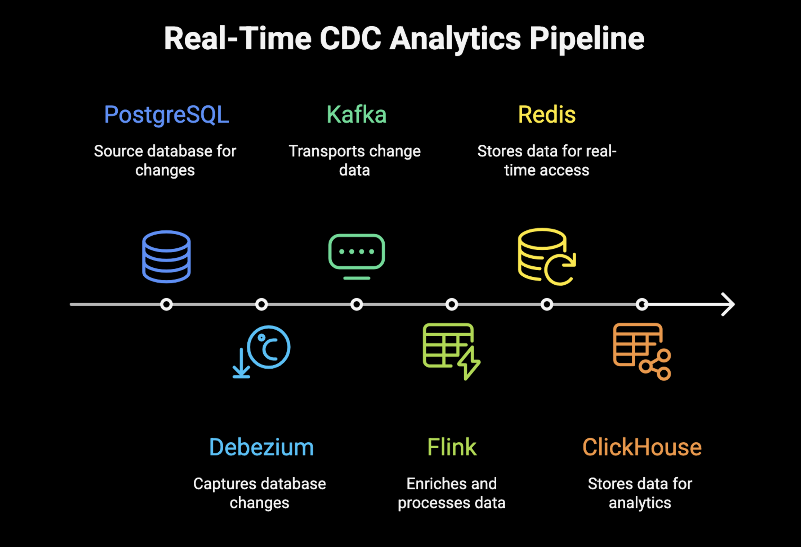

# Real-Time CDC Analytics Pipeline with ClickHouse

A production-ready Change Data Capture (CDC) pipeline that captures PostgreSQL database changes in real-time, enriches them with Apache Flink , and stores results in both Redis for real-time access and ClickHouse for analytical workloads.

## Architecture



PostgreSQL → Debezium → Kafka → Flink → Redis + ClickHouse (+ optional external Kafka outbox)

- PostgreSQL: source tables `public.content`, `public.engagement_events`
- Debezium: streams row‑level changes
- Kafka: durable transport and fan‑out
- Flink: enrichment, joins, aggregation, multi‑sink
- Redis: real‑time use cases
- ClickHouse: analytics warehouse

## Run locally

### Prerequisites
- Docker + Docker Compose
- 8 GB RAM available

### Steps
1) Clone and enter the project
```bash
git clone <repository-url>
cd "CDC-POC"
```
2) Start everything
```bash
./deploy.sh
```
3) UIs
- Kafka UI: http://localhost:8080
- Flink UI: http://localhost:8081
- Kafka Connect: http://localhost:8083

---

## Architecture discussion (expanded)

### Debezium + Kafka (why)
Debezium tails PostgreSQL’s WAL to emit change events without app code or triggers. It preserves per‑key ordering and captures inserts/updates/deletes with before/after images. Kafka adds durable retention for replay/backfill, offset control, and clean decoupling so you can scale ingestion and consumers independently.

### Schema Registry (why)
A central contract for message formats and compatibility rules. Using Avro/JSON‑Schema/Protobuf with Schema Registry prevents breaking changes, enables safe evolution, and improves tooling (validation, codegen, diffs). It reduces integration risk across multiple consumers.

### Flink (why)
Flink provides low‑latency, stateful streaming with checkpointed, exactly‑once state. Broadcast state lets us keep `content` in memory and join it with high‑volume `engagement` events efficiently, then fan‑out to multiple sinks. Compared to bespoke consumers, you get stronger guarantees, simpler scaling, and good observability.

### Why ClickHouse for OLAP
Columnar, vectorized execution with great compression makes scans and aggregations fast and cost‑effective. ReplacingMergeTree helps collapse duplicates from at‑least‑once sinks; materialized views give quick hourly/daily rollups. It’s easy to run locally and delivers strong price/performance for CDC analytics.

### What we may enhance
- StarRocks instead of ClickHouse: excels at star‑schema queries, materialized views, and real‑time updates; strong MySQL protocol and vectorized execution make it a great fit for dimensional models.
- Credentials and security: avoid broad service accounts; use least‑privilege DB users, secret managers (Vault/KMS), rotation, and short‑lived tokens. Limit network exposure and enable TLS where supported.
- Images and distribution: publish application images to Docker Hub/GHCR so anyone can run the stack with a single pull; pin versions for reproducibility.
- Kafka topology: choose partitions by expected throughput and key affinity (e.g., hash by `content_id` or `user_id`), set retention/compaction per use case, and use DLQ patterns for poison messages if needed.

## Production recommendations

- Open‑source OLAP: StarRocks
  - Strong real‑time analytics, materialized views, and star‑schema performance; integrates well with CDC and supports fast updates/joins.

- Commercial OLAP/lakehouse: Snowflake, Databricks
  - End‑to‑end platform capabilities (governance, sharing, streaming/ML integrations), elastic scale, rich ecosystems, and mature ops tooling.

- Not BigQuery 
  -  More costly with fewer specialized features compared to Snowflake/Databricks for analytical workloads.

- CDC platform and infra
  - If standardizing on Kafka/Flink for real‑time, Use Confluent (managed Kafka, Schema Registry, Connect) simplifies ops, adds governance and exactly‑once features, and reduces toil at scale.

## Notes
- Exactly‑once: Flink uses checkpoints for source/state; Redis/ClickHouse are at‑least‑once. We mitigate duplicates with ClickHouse ReplacingMergeTree and can add idempotent Redis writes or EOS Kafka outbox if required.
- Backfill: reset consumer offsets (engagement + content) to reprocess; storage dedup keeps analytics consistent.